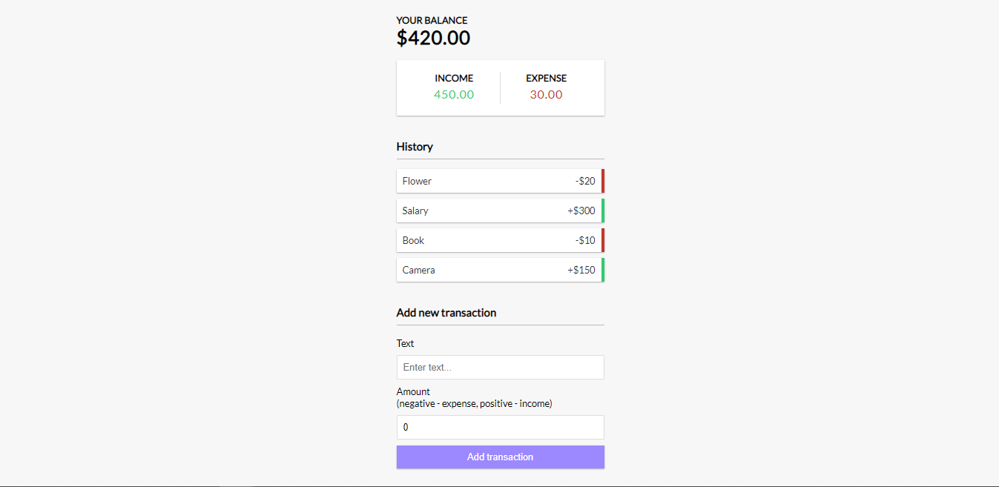

# Expense Tracker

This project is implemented using React.js.
This project uses React Hooks and Context API to maintain the app state.

If you wish to run this project locally

`npm install`

`npm start`

`Visit http://localhost:3000`

## Screenshot

